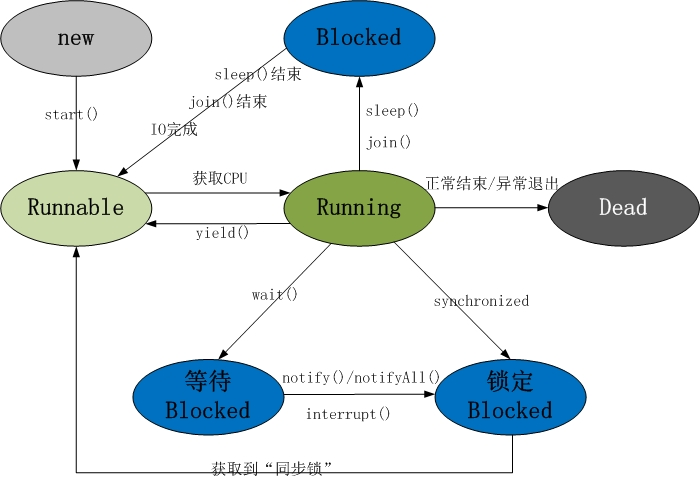
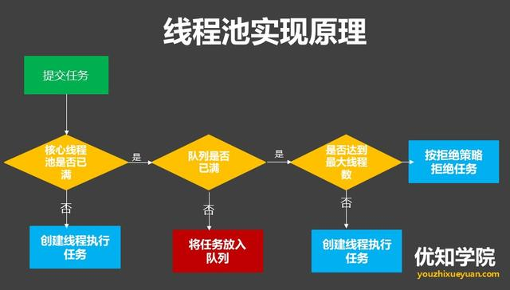

## 一、基础知识

### 1、Object中有哪些方法，作用是什么

#### （1）hashCode

提供此方法支持的原因是，为了支持一些 hash tables，在不修改 equals 方法的前提下，
在一次程序执行期间，多次调用同一个对象的 hashCode 方法，得到的结果始终应该是一个相同的整数。
如果两个对象的 equals 方法返回值一样，则调用它们各自的 hashCode 方法，返回值也必须保证一样。Object 对象的 hashCode 方法，不同的对象在调用的时候，确实返回了不同的结果，得益于本地实现，返回了对象的内存地址 。
#### （2）equals

equals方法具有以下特性：a：自反性，对于非 null 引用 x， x.equals(x) 应该返回 true。b：对称性，对于非 null 引用 x，y， x.equals(y) 的返回值应该和 y.equals(x) 的返回值保持一致；
#### （3）clone
Object中的clone方法是浅拷贝，当对象中含有可变的引用类型属性时，在复制得到的新对象对该引用类型属性内容进行修改，原始对象响应的属性内容也会发生变化，这就是"浅拷贝"的现象。
#### （4）toString

#### （5）notify、notifyAll
notify/notifyAll() 执行后会唤醒处于等待状态线程获取线程锁、只是notify()只会随机唤醒其中之一获取线程锁，notifyAll() 会唤醒所有处于等待状态的线程抢夺线程锁。
#### （6）wait()、wait(long timeout, int nanos)、wait(long timeout)
wait()执行后拥有当前锁的线程会释放该线程锁，并处于等待状态（等待重新获取锁）

### 2、Error和Exception有什么区别

Error表示系统级的错误和程序不必处理的异常，是恢复不是不可能但很困难的情况下的一种严重问题；比如内存溢出，不可能指望程序能处理这样的情况；Exception表示需要捕捉或者需要程序进行处理的异常，是一种设计或实现问题；也就是说，它表示如果程序运行正常，从不会发生的情况。

### 3、try{}里有一个return语句，那么紧跟在这个try后的finally{}里的代码会不会被执行，什么时候被执行，在return前还是后

会执行，在方法返回调用者前执行

### 4、列出一些你常见的运行时异常

ArithmeticException（算术异常）
ClassCastException （类转换异常）
IllegalArgumentException （非法参数异常）
IndexOutOfBoundsException （下标越界异常）
NullPointerException （空指针异常）
SecurityException （安全异常）

## 二、多线程

### 1、Java中锁的分类

#### （1）公平锁/非公平锁
公平锁是指多个线程按照申请锁的顺序来获取锁。非公平锁是指多个线程获取锁的顺序并不是按照申请锁的顺序，有可能后申请的线程比先申请的线程优先获取锁。有可能，会造成优先级反转或者饥饿现象。
对于Java ReentrantLock而言，通过构造函数指定该锁是否是公平锁，默认是非公平锁。非公平锁的优点在于吞吐量比公平锁大。对于Synchronized而言，也是一种非公平锁。
#### （2）可重入锁
可重入锁又名递归锁，是指在同一个线程在外层方法获取锁的时候，在进入内层方法会自动获取锁。说
#### （3）独享锁/共享锁
独享锁是指该锁一次只能被一个线程所持有。共享锁是指该锁可被多个线程所持有。
#### （4）互斥锁/读写锁
互斥锁在Java中的具体实现就是ReentrantLock，读写锁在Java中的具体实现就是ReadWriteLock
#### （5）乐观锁/悲观锁
悲观锁在Java中的使用，就是利用各种锁。乐观锁在Java中的使用，是无锁编程，常常采用的是CAS算法，典型的例子就是原子类，通过CAS自旋实现原子操作的更新。
#### （6）分段锁
分段锁其实是一种锁的设计，并不是具体的一种锁，对于ConcurrentHashMap而言，其并发的实现就是通过分段锁的形式来实现高效的并发操作。
#### （6）偏向锁/轻量级锁/重量级锁
这三种锁是指锁的状态，并且是针对Synchronized。
偏向锁是指一段同步代码一直被一个线程所访问，那么该线程会自动获取锁。降低获取锁的代价。
轻量级锁是指当锁是偏向锁的时候，被另一个线程所访问，偏向锁就会升级为轻量级锁，其他线程会通过自旋的形式尝试获取锁，不会阻塞，提高性能。
重量级锁是指当锁为轻量级锁的时候，另一个线程虽然是自旋，但自旋不会一直持续下去，当自旋一定次数的时候，还没有获取到锁，就会进入阻塞，该锁膨胀为重量级锁。重量级锁会让其他申请的线程进入阻塞，性能降低。
#### （7）自旋锁
在Java中，自旋锁是指尝试获取锁的线程不会立即阻塞，而是采用循环的方式去尝试获取锁，这样的好处是减少线程上下文切换的消耗，缺点是循环会消耗CPU。

### 2、Java内存模型
为了保证共享内存的正确性（可见性、有序性、原子性），内存模型定义了共享内存系统中多线程程序读写操作行为的规范。内存模型解决并发问题主要采用两种方式：限制处理器优化和使用内存屏障。
Java内存模型（Java Memory Model ,JMM）就是一种符合内存模型规范的，屏蔽了各种硬件和操作系统的访问差异的，保证了Java程序在各种平台下对内存的访问都能保证效果一致的机制及规范。
JMM是一种规范，目的是解决由于多线程通过共享内存进行通信时，存在的本地内存数据不一致、编译器会对代码指令重排序、处理器会对代码乱序执行等带来的问题。目的是保证并发编程场景中的原子性、可见性和有序性。
#### （1）Java内存模型的实现
在Java中提供了一系列和并发处理相关的关键字，比如volatile、synchronized、final、concurren包等。其实这些就是Java内存模型封装了底层的实现后提供给程序员使用的一些关键字。
#### （2）原子性
为了保证原子性，提供了两个高级的字节码指令monitorenter和monitorexit。在Java中可以使用synchronized来保证方法和代码块内的操作是原子性的。
#### （3）可见性
Java中的volatile关键字提供了一个功能，那就是被其修饰的变量在被修改后可以立即同步到主内存，被其修饰的变量在每次是用之前都从主内存刷新。因此，可以使用volatile来保证多线程操作时变量的可见性。synchronized和final两个关键字也可以实现可见性
#### （4）有序性
在Java中，可以使用synchronized和volatile来保证多线程之间操作的有序性。实现方式有所区别：volatile关键字会禁止指令重排。synchronized关键字保证同一时刻只允许一条线程操作。

### 3、synchronized关键字
#### （1）synchronized的用法
synchronized是Java提供的一个并发控制的关键字。主要有两种用法，分别是同步方法和同步代码块。
```
public class SynchronizedTest {
      //同步方法
     public synchronized void doSth1(){
         System.out.println("Hello World");
     }
     //同步代码块
     public void doSth2(){
         synchronized (SynchronizedTest.class){
             System.out.println("Hello World");
         }
     }
 }
```
#### （2）synchronized的实现原理
我们对上面的代码进行反编译，可以得到如下代码：
```
public synchronized void doSth();
    descriptor: ()V
    flags: ACC_PUBLIC, ACC_SYNCHRONIZED
    Code:
      stack=2, locals=1, args_size=1
         0: getstatic     #2                  // Field java/lang/System.out:Ljava/io/PrintStream;
         3: ldc           #3                  // String Hello World
         5: invokevirtual #4                  // Method java/io/PrintStream.println:(Ljava/lang/String;)V
         8: return

  public void doSth1();
    descriptor: ()V
    flags: ACC_PUBLIC
    Code:
      stack=2, locals=3, args_size=1
         0: ldc           #5                  // class com/hollis/SynchronizedTest
         2: dup
         3: astore_1
         4: monitorenter
         5: getstatic     #2                  // Field java/lang/System.out:Ljava/io/PrintStream;
         8: ldc           #3                  // String Hello World
        10: invokevirtual #4                  // Method java/io/PrintStream.println:(Ljava/lang/String;)V
        13: aload_1
        14: monitorexit
        15: goto          23
        18: astore_2
        19: aload_1
        20: monitorexit
        21: aload_2
        22: athrow
        23: return
```
对于同步方法，JVM采用ACC_SYNCHRONIZED标记符来实现同步。 
对于同步代码块。JVM采用monitorenter、monitorexit两个指令来实现同步。
自Java 6/Java 7开始，Java虚拟机对内部锁的实现进行了一些优化。这些优化主要包括锁消除（Lock Elision）、锁粗化（Lock Coarsening）、偏向锁（Biased Locking）以及适应性自旋锁（Adaptive Locking）。这些优化仅在Java虚拟机server模式下起作用.

### 4、volatile关键字解决了什么问题，实现原理是什么
Java提供了volatile关键字来保证可见性。当一个共享变量被volatile修饰时，它会保证修改的值会立即被更新到主存，当有其他线程需要读取时，它会去内存中读取新值。可以通过volatile关键字来保证一定的“有序性”。volatile不能保证原子性。
#### （1）happens-before原则（先行发生原则）：
	• 程序次序规则：一个线程内，按照代码顺序，书写在前面的操作先行发生于书写在后面的操作
	• 锁定规则：一个unLock操作先行发生于后面对同一个锁额lock操作
	• volatile变量规则：对一个变量的写操作先行发生于后面对这个变量的读操作
	• 传递规则：如果操作A先行发生于操作B，而操作B又先行发生于操作C，则可以得出操作A先行发生于操作C
	• 线程启动规则：Thread对象的start()方法先行发生于此线程的每个一个动作
	• 线程中断规则：对线程interrupt()方法的调用先行发生于被中断线程的代码检测到中断事件的发生
	• 线程终结规则：线程中所有的操作都先行发生于线程的终止检测，我们可以通过Thread.join()方法结束、Thread.isAlive()的返回值手段检测到线程已经终止执行
	• 对象终结规则：一个对象的初始化完成先行发生于他的finalize()方法的开始
#### （2）volatile关键字的两层语义
	• 保证了不同线程对这个变量进行操作时的可见性，即一个线程修改了某个变量的值，这新值对其他线程来说是立即可见的。
	• 禁止进行指令重排序
#### （3）volatile的原理和实现机制
观察加入volatile关键字和没有加入volatile关键字时所生成的汇编代码发现，加入volatile关键字时，会多出一个lock前缀指令lock前缀指令实际上相当于一个内存屏障（也成内存栅栏），内存屏障会提供3个功能：

	• 它确保指令重排序时不会把其后面的指令排到内存屏障之前的位置，也不会把前面的指令排到内存屏障的后面；即在执行到内存屏障这句指令时，在它前面的操作已经全部完成；
	• 它会强制将对缓存的修改操作立即写入主存；
	• 如果是写操作，它会导致其他CPU中对应的缓存行无效。

### 5、Java多线程的5大状态，以及状态图流转过程



#### （1）新建状态(New): 
线程对象被创建后，就进入了新建状态。例如，Thread thread = new Thread()。
#### （2）就绪状态(Runnable): 
也被称为“可执行状态”。线程对象被创建后，其它线程调用了该对象的start()方法，从而来启动该线程。例如，thread.start()。处于就绪状态的线程，随时可能被CPU调度执行。
#### （3）运行状态(Running) : 
线程获取CPU权限进行执行。需要注意的是，线程只能从就绪状态进入到运行状态。
#### （4）阻塞状态(Blocked) : 
阻塞状态是线程因为某种原因放弃CPU使用权，暂时停止运行。直到线程进入就绪状态，才有机会转到运行状态。阻塞的情况分三种：

	• 等待阻塞 -- 通过调用线程的wait()方法，让线程等待某工作的完成。
	• 同步阻塞 -- 线程在获取synchronized同步锁失败(因为锁被其它线程所占用)，它会进入同步阻塞状态。
	• 其他阻塞 -- 通过调用线程的sleep()或join()或发出了I/O请求时，线程会进入到阻塞状态。当sleep()状态超时、join()等待线程终止或者超时、或者I/O处理完毕时，线程重新转入就绪状态。

#### （5）死亡状态(Dead): 
线程执行完了或者因异常退出了run()方法，该线程结束生命周期。

### 5、线程同步和通信方式
线程间的同步方式有四种
#### （1）临界区 
#### （2）互斥量
#### （3）信号量 
#### （4）事件
线程间的通信方式有三种
#### （1）使用全局变量
#### （2）使用消息实现通信
#### （3）使用事件CEvent类实现线程间通信

### 6、线程创建的方式
#### （1）继承Thread类
~~~
class Thread1Test extends Thread{
        @Override
        public void run() {

        }
 }
~~~
#### （2）实现Runnable接口
~~~
class RunnableTest implements Runnable{
        @Override
        public void run() {

        }
 }
~~~
#### （3）实现Callable接口
~~~
class CallableTest implements Callable<Integer>{
        @Override
        public Integer call() throws Exception {
            return null;
        }
}
~~~

### 7、线程

### 8、线程池
线程池的构造参数如下：

~~~
public ThreadPoolExecutor(int corePoolSize,
                              int maximumPoolSize,
                              long keepAliveTime,
                              TimeUnit unit,
                              BlockingQueue<Runnable> workQueue,
                              ThreadFactory threadFactory,
                              RejectedExecutionHandler handler) {
        if (corePoolSize < 0 ||
            maximumPoolSize <= 0 ||
            maximumPoolSize < corePoolSize ||
            keepAliveTime < 0)
            throw new IllegalArgumentException();
        if (workQueue == null || threadFactory == null || handler == null)
            throw new NullPointerException();
        this.acc = System.getSecurityManager() == null ?
                null :
                AccessController.getContext();
        this.corePoolSize = corePoolSize;
        this.maximumPoolSize = maximumPoolSize;
        this.workQueue = workQueue;
        this.keepAliveTime = unit.toNanos(keepAliveTime);
        this.threadFactory = threadFactory;
        this.handler = handler;
    }
~~~

线程池的实现原理如下：



_图片来自：https://youzhixueyuan.com/_
#### （1）先判断线程池中的核心线程们是否空闲，如果空闲，就把这个新的任务指派给某一个空闲线程去执行。如果没有空闲，并且当前线程池中的核心线程数还小于 corePoolSize，那就再创建一个核心线程。
#### （2）如果线程池的线程数已经达到核心线程数，并且这些线程都繁忙，就把这个新来的任务放到等待队列中去。如果等待队列又满了，那么查看一下当前线程数是否到达maximumPoolSize，如果还未到达，就继续创建线程。
#### （3）如果已经到达了，就交给RejectedExecutionHandler(拒绝策略)来决定怎么处理这个任务。
#### （4）构造器中各个参数的含义：

	• corePoolSize（线程池的基本大小）

当提交一个任务到线程池时，线程池会创建一个线程来执行任务，即使其他空闲的基本线程能够执行新任务也会创建线程，等到需要执行的任务数大于线程池基本大小时就不再创建。如果调用了线程池的prestartAllCoreThreads方法，线程池会提前创建并启动所有基本线程。

	• runnableTaskQueue（任务队列）

用于保存等待执行的任务的阻塞队列。可以选择以下几个阻塞队列。
 ArrayBlockingQueue：是一个基于数组结构的有界阻塞队列，此队列按 FIFO（先进先出）原则对元素进行排序。
 LinkedBlockingQueue：一个基于链表结构的阻塞队列，此队列按FIFO （先进先出） 排序元素，吞吐量通常要高于ArrayBlockingQueue。
 SynchronousQueue：一个不存储元素的阻塞队列。每个插入操作必须等到另一个线程调用移除操作，否则插入操作一直处于阻塞状态，吞吐量通常要高于LinkedBlockingQueue。
 PriorityBlockingQueue：一个具有优先级得无限阻塞队列。

	• maximumPoolSize（线程池最大大小）

线程池允许创建的最大线程数。如果队列满了，并且已创建的线程数小于最大线程数，则线程池会再创建新的线程执行任务。值得注意的是如果使用了无界的任务队列这个参数就没什么效果。

	• ThreadFactory：用于设置创建线程的工厂

可以通过线程工厂给每个创建出来的线程设置更有意义的名字，Debug和定位问题时非常又帮助。

	• RejectedExecutionHandler（饱和策略）

当队列和线程池都满了，说明线程池处于饱和状态，那么必须采取一种策略处理提交的新任务。这个策略默认情况下是AbortPolicy，表示无法处理新任务时抛出异常。以下是JDK1.5提供的四种策略。
AbortPolicy：直接抛出异常。
CallerRunsPolicy：只用调用者所在线程来运行任务。
DiscardOldestPolicy：丢弃队列里最近的一个任务，并执行当前任务。
DiscardPolicy：不处理，丢弃掉。
当然也可以根据应用场景需要来实现RejectedExecutionHandler接口自定义策略。如记录日志或持久化不能处理的任务。

#### （5）Executors类
Executors类，提供了一系列工厂方法用于创建线程池，返回的线程池都实现了ExecutorService接口。
Executors提供四种线程池，newFixedThreadPool、newCachedThreadPool、newSingleThreadExecutor、newScheduledThreadPool。
a.newFixedThreadPool：创建一个可重用固定线程数的线程池，以共享的无界队列方式来运行这些线程。
~~~
public static ExecutorService newFixedThreadPool(int nThreads) {
        return new ThreadPoolExecutor(nThreads, nThreads,
                                      0L, TimeUnit.MILLISECONDS,
                                      new LinkedBlockingQueue<Runnable>());
}
~~~
b.newCachedThreadPool：创建一个可缓存线程池，如果线程池长度超过处理需要，可灵活回收空闲线程
~~~
public static ExecutorService newCachedThreadPool() {
        return new ThreadPoolExecutor(0, Integer.MAX_VALUE,
                                      60L, TimeUnit.SECONDS,
                                      new SynchronousQueue<Runnable>());
}
~~~
c.newSingleThreadExecutor：创建一个单线程化的线程池，它只会用唯一的工作线程来执行任务，保证所有任务按照指定顺序(FIFO, LIFO, 优先级)执行
~~~
public static ExecutorService newSingleThreadExecutor() {
        return new FinalizableDelegatedExecutorService
            (new ThreadPoolExecutor(1, 1,
                                    0L, TimeUnit.MILLISECONDS,
                                    new LinkedBlockingQueue<Runnable>()));
}
~~~
d.newScheduledThreadPool：创建一个定长线程池，支持定时及周期性任务执行
~~~
public static ScheduledExecutorService newScheduledThreadPool(int corePoolSize) {
        return new ScheduledThreadPoolExecutor(corePoolSize);
}
~~~
## 三、集合

## 四、IO

## 五、Java虚拟机
